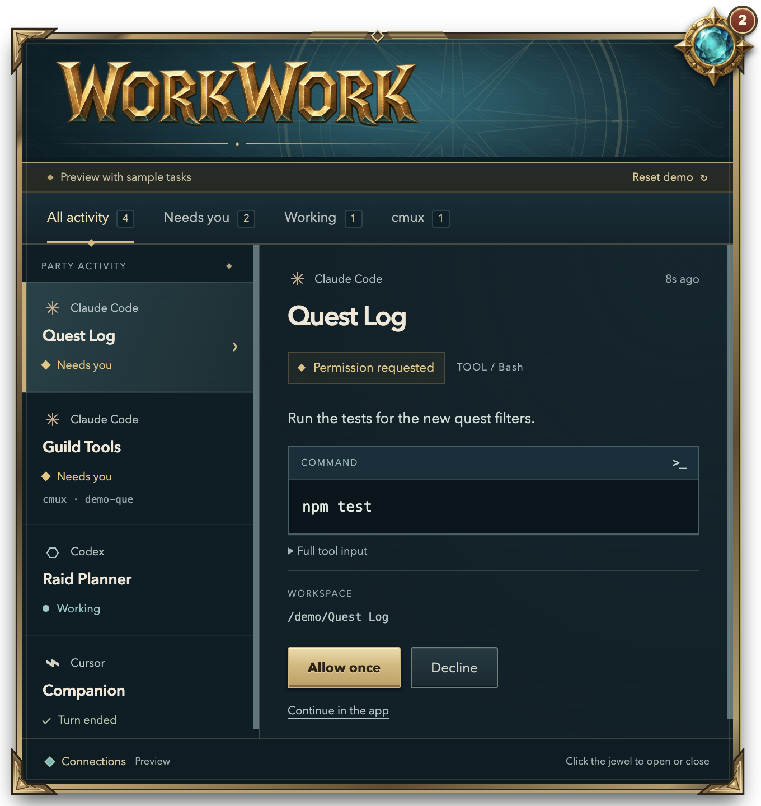

# workwork


A floating desktop companion for Claude Code, Codex, and Cursor. A draggable gem counts tasks waiting for you; click it to open a dashboard, review supported actions, or answer a question while playing.



_Demo with fictional tasks. New installs start empty._

workwork is a **macOS prototype** you can run from source or build as a Mac app. It uses a normal Electron window above the game and local agent hooks. It does not modify the game, read conversations, or make model calls. The turquoise and gold artwork is original; this project is not affiliated with Blizzard, Anthropic, OpenAI, Cursor, or cmux.

## Run

Install Node.js **22.12.0 or newer**, then clone and run:

```sh
git clone https://github.com/its-panzer/workwork.git
cd workwork
npm ci
npm start
```

New installs start with an empty task list and no connected agents. Open **Connections** to opt in to each integration. No accounts, API keys, personal task data, or someone else's settings are bundled. Existing cmux sessions can appear when cmux is already running on your own machine.

To preview the UI without connecting any agents:

```sh
npm run demo
```

The demo uses fictional tasks in an isolated temporary profile. Its buttons do not approve real actions or change agent settings. It is opt-in and never seeds your live dashboard. **Reset demo** restores the sample scene; **Start live setup** opens the live app.

Click the jewel to open or close the pane. Drag the jewel or the expanded title area to move it. The badge counts observed requests, not running tasks. **⌘ Shift Space** toggles the pane; the menu bar provides Open, Collapse, Hide, and Quit. First-run tips introduce the jewel and **Connections**.

Use a windowed or borderless game for initial testing. Behavior over the actual WoW Forever client, exclusive fullscreen, and Windows has not been verified.

## Build the Mac app

On a Mac with Node.js 22.12.0 or newer:

```sh
npm ci
npm run build:mac
```

The build creates `dist/workwork-darwin-arm64/workwork.app` on Apple Silicon, or `dist/workwork-darwin-x64/workwork.app` on Intel, plus `dist/workwork-mac-<architecture>.zip`. To build for the other architecture, use `npm run build:mac -- --arch=x64` or `--arch=arm64`.

1. If you connected agents from a source checkout, disconnect them there first, then quit that workwork instance. This prevents duplicate hooks.
2. Copy **workwork.app** into **Applications** before connecting agents.
3. Double-click the app. It has its own Finder/Dock icon; clicking its Dock icon reopens the pane. Closing its window keeps the companion running; use **Quit** to exit.
4. Open **Connections** and connect your agents. Reload and trust the new paths in Codex. Your existing `~/.workwork` activity and preferences are retained.

Keep Node installed: the app includes Electron, while agent hooks run with Node outside the app. Homebrew's standard Node locations are detected even when launching from Finder. Moving the app or changing the Node installation requires disconnecting and reconnecting hooks. Quit the installed app before replacing it with a new build at the same path.

The build uses a local ad-hoc signature, verifies the bundle, and starts the packaged runtime when building for the current Mac's architecture. It is **not Apple-notarized**; a public downloadable release still needs Developer ID signing, hardened runtime configuration, and notarization. No Apple account or certificate is required to build locally. The icon master is `app/assets/workwork-icon.png`; `npm run build:icon` regenerates every macOS icon size and the `.icns` file.

## Connect your agents

Open **Connections** and click **Connect** for an app, or **Connect all three**. workwork preserves other hooks and makes a backup beside each changed settings file, including configurations managed through symlinks.

### Claude Code

1. Connect Claude Code in workwork.
2. Open or resume a Claude Code session, in cmux or another terminal. Complete its normal workspace trust prompt if needed.
3. Continue a task. **Receiving activity** confirms a new event reached workwork.

Hook changes normally load automatically. If activity stays quiet, check `/hooks`, reconnect in workwork, then restart Claude Code and resume.

### Codex

1. Connect Codex in workwork. This covers standalone Codex and Codex in cmux.
2. In the Codex app, open **Settings → Hooks → Reload hooks**. The CLI uses `/hooks`.
3. Review and trust the entries pointing to `workwork/hooks`. New or changed definitions need trust before they run.
4. Continue a task and look for **Receiving activity**.

**Awaiting Codex** means no real event has arrived yet. Existing standalone tasks are not imported: tracking begins with new hook events. Question dialogs that do not emit supported hooks stay in Codex.

### Cursor

1. Connect Cursor in workwork.
2. Continue a local Agent chat. Hook settings normally reload automatically.
3. Leave **Using Cursor’s settings** active to respect the session’s auto-run policy. Activity appears in workwork; approvals and questions required by Cursor stay in Cursor.

**Review every action** is an optional extra gate before every shell command and MCP action, including actions Cursor would auto-run. Choose **Use Cursor’s settings** to remove those extra gates. Already-waiting workwork reviews return to Cursor without being approved; an existing action may still need a one-time response there.

Check **Customize → Hooks** or the Hooks output channel if events do not arrive. Reconnect to repair missing entries; restart Cursor if necessary. Cloud agents and IDE question dialogs are outside this integration. Cursor imports Claude settings too; workwork ignores those duplicate callbacks.

### cmux

Install cmux at `/Applications/cmux.app`, open it, and run Claude Code or Codex inside a pane. workwork checks cmux session metadata every five seconds and combines matching sessions with hook activity. It does not read terminal text or the cmux socket password.

**Open cmux session** opens the exact pane. **Copy and open session** copies a follow-up for you to paste there. Direct send and interrupt are not implemented.

### Check, repair, or disconnect

**Hooks installed** checks the definitions in the app's settings. **Receiving activity** means an actual app event arrived within 15 minutes. **Test local receiver** checks delivery from workwork's own hook subprocess; it does not prove that an agent loaded or trusted its hooks.

The command-line setup offers the same operations:

```sh
npm run setup                         # Preview paths and events
npm run setup -- --install             # Connect all three
npm run setup -- --remove              # Disconnect all three
npm run setup -- --install --provider=codex
```

Providers are `claude`, `codex`, and `cursor`. Settings currently use the default locations: `~/.claude/settings.json`, `~/.codex/hooks.json`, and `~/.cursor/hooks.json`. Custom `CLAUDE_CONFIG_DIR` or `CODEX_HOME` locations are not supported by setup. cmux discovery also expects the default application location above.

**Disconnect before moving or deleting this checkout, the installed app, or its Node runtime.** Installed hooks contain absolute paths. After moving, reconnect from the new location and reload/trust Codex hooks. If already moved, restore the old location to disconnect, or remove only the command entries pointing to that old installation in each agent's hook settings. Reconnecting from a new path does not remove old entries. This matters especially for Cursor action reviews, whose failed hooks block actions.

## What you can do in the pane

| Source      | Activity                                     | Approvals                           | Questions                              |
| ----------- | -------------------------------------------- | ----------------------------------- | -------------------------------------- |
| Claude Code | Sessions, tools, turn and session endings    | `PermissionRequest` hooks           | `AskUserQuestion` and simple MCP forms |
| Codex       | Sessions, tools, turn endings, interruptions | `PermissionRequest` hooks           | Open the source app                    |
| Cursor      | Local sessions, tools, turn endings          | Optional shell and MCP review gates | Open the source app                    |

Cursor’s hook payload does not expose the session’s effective auto-run policy or whether it would show a native approval. The default connection therefore installs activity hooks only. Optional workwork reviews add a gate before every action; they cannot selectively mirror native approval prompts. Codex approvals routed through question dialogs may not emit `PermissionRequest`. The badge therefore cannot be a complete inbox for every agent interaction.

Each request has its own ID and countdown: two minutes for Claude Code/Codex, ten minutes for Cursor reviews. **Allow once**, **Decline**, and **Send answer** apply only to that invocation. **Continue in the app**, quitting workwork, or an orderly deadline expiry returns control without approving. Collapsing or hiding the pane keeps workwork running.

A queued response has not yet been acknowledged. **Response sent** means the waiting hook read it; it does not mean the task ran successfully. Other installed hooks may still deny or alter the action. Cursor's review hooks use a 620-second timeout and `failClosed: true`, so an unexpected crash blocks the action rather than silently approving it. Choose **Use Cursor’s settings** in Connections to remove these gates and keep activity tracking.

MCP forms support strings, booleans, numbers, integers, and primitive enums. More complex schemas return to the source app. A “Turn ended” signal does not establish that tests passed or all background work stopped. Quiet active tasks become **No recent signal** after 15 minutes; stored rows expire after 24 hours.

## Local data

workwork stores preferences and task metadata in `~/.workwork/`, using owner-only file permissions. `WORKWORK_HOME` overrides this directory; the app and its hooks must share the same value. `WORKWORK_NODE` can point to a Node executable when connecting agents from the app.

Persisted task events contain identity, project basename, status, timestamps, and optional cmux pane IDs. Pending requests temporarily contain the tool input or question needed for review. Hook completion removes the request and answer files; the running app also cleans abandoned files. It cannot clean files while it is stopped. See [SECURITY.md](SECURITY.md) for the local trust boundary and what to omit from bug reports.

## Development

```sh
npm run check
npm run smoke
npm run smoke:connections
npm run source:archive
```

Tests use synthetic inputs and isolated settings. They do not call models or answer real requests. Electron smoke tests require a desktop session and save captures to ignored `artifacts/`. The archive command writes `artifacts/workwork-source.tar.gz` from an explicit file allowlist; it excludes installed dependencies, runtime state, and local screenshots.

See [CONTRIBUTING.md](CONTRIBUTING.md) for the code map and [the release review](docs/release-review.md) for verification and current limits.

## License

Original code and artwork are available under the [MIT License](LICENSE). Third-party dependencies and trademarks retain their own terms; see [NOTICE](NOTICE).

## Integration references

The adapters follow [Claude Code hooks](https://code.claude.com/docs/en/hooks), [Codex hooks](https://learn.chatgpt.com/docs/hooks), and [Cursor hooks](https://cursor.com/docs/hooks). cmux uses its [CLI](https://cmux.com/docs/api) and [workspace URL scheme](https://github.com/manaflow-ai/cmux/blob/main/Sources/CmuxSSHURLRequest.swift). The overlay uses Electron's [BrowserWindow](https://www.electronjs.org/docs/latest/api/browser-window).

The [asset provenance](app/assets/README.md) includes the medallion generation prompt. No game logo, screenshot, or audio is bundled.
